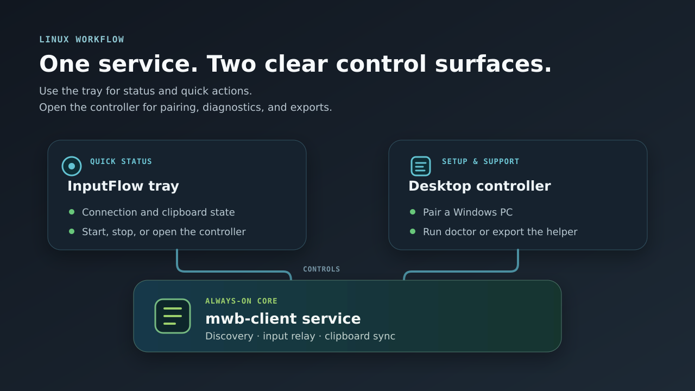

# InputFlow

[](https://github.com/daredoole/inputflow-linux/actions/workflows/ci.yml)
[](docs/release-readiness-report.md)
[](CHANGELOG.md)
[](LICENSE)

InputFlow is a native C++17 Linux companion for
[Microsoft PowerToys Mouse Without Borders](https://learn.microsoft.com/windows/powertoys/mouse-without-borders).
It lets a Windows keyboard and pointer control Linux, synchronizes clipboard
content, provides Linux tray and service integration, and can expose an
encrypted relay to an Android peer.

> **Public beta:** InputFlow is usable, but desktop-compositor and reconnect
> edge cases are still being validated. Review the
> [release-readiness report](docs/release-readiness-report.md) and
> [compatibility guide](docs/compatibility.md) before deployment.



## Contents

- [Why InputFlow](#why-inputflow)
- [Features](#features)
- [Compatibility](#compatibility)
- [Security and privacy](#security-and-privacy)
- [Requirements](#requirements)
- [Build from source](#build-from-source)
- [First run](#first-run)
- [Connection modes](#connection-modes)
- [Command line](#command-line)
- [Testing and release builds](#testing-and-release-builds)
- [Documentation](#documentation)
- [Support and contributing](#support-and-contributing)
- [License and attribution](#license-and-attribution)

## Why InputFlow

PowerToys Mouse Without Borders does not provide a native Linux peer.
InputFlow fills that gap while keeping the default workflow compatible with
PowerToys machine placement. Advanced topology, Android relay, diagnostics,
and recovery tools remain opt-in.

InputFlow is not a Barrier, Synergy, Input Leap, Deskflow, or Cursr protocol
implementation.

## Features

- Keyboard, pointer, media-key, and absolute-coordinate input on Linux.
- Text, HTML, and image clipboard synchronization.
- PowerToys-compatible Windows pairing helper.
- Automatic reconnection and approved-peer rediscovery after DHCP, VPN,
  resume, or network changes.
- GTK controller and system tray for status, peers, settings, diagnostics,
  service control, and topology.
- User-level systemd service integration.
- Optional multi-monitor topology and edge handoff.
- Optional Android relay with Accessibility, Shizuku, or root injection
  backends.
- Privacy-redacted, local-only diagnostics bundles.
- Portable Linux archive, Android APK, SBOM, checksums, and provenance
  generated by the release gate.

## Compatibility

| Component | Status | Notes |
| --- | --- | --- |
| Linux on X11 | Supported beta path | Uses `/dev/uinput`; clipboard requires `xclip` or `xsel`. |
| Linux on Wayland | Supported with caveats | Uses `/dev/uinput`; clipboard requires `wl-clipboard`; the compositor may display one input-capture permission request. |
| PowerToys MWB on Windows | Target peer | Use the exported pairing helper whenever possible. |
| Android | Optional beta peer | Requires the InputFlow Android app and an enabled relay. |
| Secret Service/keyring | Supported when available | Recommended for interactive desktop sessions. |
| Protected key file | Supported | Suitable for services when owner-only permissions are maintained. |

The default is PowerToys-compatible machine-level placement. Display-level
topology is disabled unless explicitly configured. See
[Compatibility](docs/compatibility.md) and [Topology](docs/topology.md) for
desktop-specific behavior.

## Security and privacy

- Configuration and state files are written atomically with owner-only
  permissions and symbolic-link targets are rejected.
- Pairing keys can be stored in the desktop keyring or in a protected file;
  inline configuration keys are supported but discouraged.
- The Android relay authenticates sessions with HMAC and encrypts
  post-authentication frames with directional AES-256-GCM keys, ordered
  sequence numbers, and replay rejection.
- PowerToys compatibility uses the protocol and cryptography required by the
  PowerToys MWB peer, including AES-256-CBC on that transport.
- Diagnostics never upload automatically. Network and journal collection are
  opt-in, and likely secrets, usernames, hostnames, addresses, and input
  metadata are redacted.
- Android backups exclude protected application data, and pairing secrets are
  protected with Android Keystore.

Read [Security and privacy](docs/security-privacy.md) for the trust model,
stored data, network exposure, and diagnostics behavior. Report
vulnerabilities using [SECURITY.md](SECURITY.md), not a public issue.

## Requirements

Core build requirements:

- A C++17 compiler
- CMake 3.16 or newer
- OpenSSL, zlib, X11, and pkg-config development files

Optional integrations:

- GTK 3 and Ayatana AppIndicator for the tray/controller
- libei, GLib/GIO, and libinput for Wayland input capture and gestures
- `wl-clipboard` on Wayland, or `xclip`/`xsel` on X11
- systemd for user-service integration

Ubuntu/Debian build dependencies:

```bash
sudo apt-get install -y build-essential cmake pkg-config libssl-dev zlib1g-dev \
  libx11-dev libei-dev libinput-dev python3-gi gir1.2-gtk-3.0 \
  libayatana-appindicator3-dev
```

Fedora build dependencies:

```bash
sudo dnf install -y gcc-c++ cmake make pkgconf-pkg-config openssl-devel \
  zlib-devel libX11-devel libei-devel libinput-devel python3-gobject gtk3 \
  libayatana-appindicator3-devel
```

Package names can differ by distribution release. Missing optional
integrations are reported during CMake configuration and by `mwb_client
doctor`.

## Build from source

```bash
git clone https://github.com/daredoole/inputflow-linux.git
cd inputflow-linux
cmake -S . -B build -DCMAKE_BUILD_TYPE=Release
cmake --build build --parallel
ctest --test-dir build --output-on-failure
```

The primary binaries are:

- `build/mwb_client` — service, CLI, diagnostics, and combined GUI entry point.
- `build/mwb_tray` — standalone system-tray controller.

## First run

### 1. Allow rootless input injection

The repository includes a narrowly scoped udev rule and system group:

```bash
sudo groupadd --system --force inputflow
sudo install -Dm0644 \
  packaging/usr/lib/udev/rules.d/70-mwb-client-uinput.rules \
  /etc/udev/rules.d/70-mwb-client-uinput.rules
sudo modprobe uinput
sudo udevadm control --reload-rules
sudo udevadm trigger --subsystem-match=misc --action=change
sudo usermod -aG inputflow "$USER"
```

Log out and back in after changing group membership. Do not grant broad access
to the system `input` group.

### 2. Create configuration

```bash
./build/mwb_client init-config \
  --config ~/.config/mwb-client/config.ini
```

For most users, open the guided controller:

```bash
./mwb-desktop-ui.sh menu
```

Enter the Windows host and shared security key in **Settings**. Prefer a peer
name over a fixed address so rediscovery can follow network changes. Use a
keyring secret ID or protected key file for long-lived configuration.

### 3. Pair Windows

Use **Export Windows Pairing Helper** in the controller, or run:

```bash
./build/mwb_client export-windows-pair \
  --config ~/.config/mwb-client/config.ini \
  --output inputflow-windows-pair.ps1
```

Review the generated script, transfer it securely, and run it on the intended
Windows peer.

### 4. Install and start the user service

```bash
./build/mwb_client install-user-service \
  --config ~/.config/mwb-client/config.ini
systemctl --user daemon-reload
systemctl --user enable --now mwb-client.service
```

Open the tray:

```bash
./build/mwb_tray
```

On KDE Plasma, the InputFlow icon may initially appear in the tray overflow.
On Wayland, approve the single desktop input-capture request if topology
handoff is enabled. A timeout or dismissal does not trigger repeated prompts;
restart InputFlow deliberately to request permission again.

Run a health check after setup:

```bash
./build/mwb_client doctor \
  --config ~/.config/mwb-client/config.ini
```

The complete guided procedure is in
[Beta workflow](docs/beta-workflow.md).

## Connection modes

| Mode | Purpose |
| --- | --- |
| `powertoys` | Default. Connect to a Windows PowerToys MWB peer. |
| `inputflow` | Run native InputFlow services, primarily the Android relay in this beta. |
| `hybrid` | Keep the PowerToys connection while enabling native InputFlow peers. |

Linux-to-Linux native transport is not yet a supported release path.

## Command line

```text
mwb_client run [--config PATH]
mwb_client discover [--state PATH]
mwb_client doctor [--config PATH] [--state PATH]
mwb_client android-pair [--config PATH] [--generate] [--ip]
mwb_client topology explain [PATH] [--config PATH]
mwb_client init-config [--config PATH] [--force]
mwb_client export-windows-pair [options]
mwb_client install-user-service [--config PATH] [--unit PATH] [--force]
mwb_client secret-store --secret-id ID [--key-file PATH | --stdin]
mwb_client secret-clear [--secret-id ID]
mwb_client gui [--config PATH] [--state PATH]
```

Run `mwb_client --help` for every option. Avoid passing secrets directly on
the command line because process listings and shell history may expose them.

## Testing and release builds

Run the native regression suite:

```bash
ctest --test-dir build --output-on-failure
```

Run the complete production gate:

```bash
scripts/release-gate.sh
```

The release gate performs repository/privacy checks, shell validation, RPM
metadata validation, a clean Release build, 18 native regression tests,
portable-archive checksum and smoke tests, Android release assembly and unit
tests, Android lint, and generation of an SBOM, provenance, and SHA-256
checksums.

Generated release artifacts are placed under
`build-release-gate/release/`. The Android APK is intentionally unsigned and
must be signed and verified outside the repository before publication.

Preview diagnostics collection without creating an archive:

```bash
scripts/inputflow-diagnostics-bundle.sh --preview
```

## Documentation

| Document | Purpose |
| --- | --- |
| [Beta workflow](docs/beta-workflow.md) | Guided setup, pairing, diagnostics, and packaging verification. |
| [Compatibility](docs/compatibility.md) | Desktop, transport, key-storage, and network caveats. |
| [Security and privacy](docs/security-privacy.md) | Trust boundaries, encryption, data handling, and diagnostics. |
| [Public repository audit](docs/public-repository-audit.md) | Secret, personal-data, device-data, history, and image-metadata assessment. |
| [Android](docs/android.md) | Android app, relay, pairing, and injection backends. |
| [Topology](docs/topology.md) | Optional multi-display topology contract and examples. |
| [Migration](docs/migration.md) | Migration from other keyboard/mouse sharing tools. |
| [Release checklist](docs/release-checklist.md) | Required signing, device matrix, soak, and publication checks. |
| [Release readiness](docs/release-readiness-report.md) | Current automated evidence and remaining external checks. |
| [Roadmap](docs/roadmap-mwb-parity.md) | PowerToys parity and future work. |
| [Packaging](packaging/README.md) | Distribution integration and user-service packaging. |
| [Changelog](CHANGELOG.md) | Version history. |

## Support and contributing

- Search existing [issues](https://github.com/daredoole/inputflow-linux/issues)
  before opening a bug or feature request.
- Use the repository issue templates and attach only the redacted diagnostics
  bundle. Review it before sharing.
- Follow [CONTRIBUTING.md](CONTRIBUTING.md) for build, test, and pull-request
  requirements.
- Participation is governed by the
  [Code of Conduct](CODE_OF_CONDUCT.md).
- Security reports follow [SECURITY.md](SECURITY.md).

## License and attribution

InputFlow is licensed under the
[GNU General Public License v3.0](LICENSE).

This project began as a fork of
[chrischip/mwb-client-linux](https://github.com/chrischip/mwb-client-linux)
and has been substantially expanded. InputFlow is independent and is not
affiliated with Microsoft. PowerToys interoperability is based on the
open-source [Microsoft PowerToys](https://github.com/microsoft/PowerToys)
implementation.
