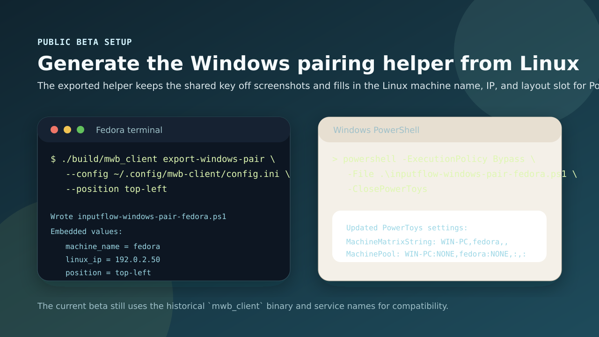

# InputFlow Public Beta Workflow

This guide covers the user-facing beta path for pairing Linux with PowerToys Mouse Without Borders on Windows, checking health, collecting diagnostics, tuning connection quality, and validating package output.

## Guided Pairing And Export Helper

Use the desktop controller for the guided path:

```bash
./mwb-desktop-ui.sh menu
```

1. Open **Settings** and enter the Windows host IP, local machine name, port, and exactly one authentication source: inline key, `key_file`, or Secret Service key ID.
2. Use **Connection Behavior** to choose automatic reconnect behavior before starting the service.
3. Export a Windows helper from Linux when the UI exposes the action, or use the CLI fallback:

```bash
./build/mwb_client export-windows-pair \
  --config ~/.config/mwb-client/config.ini \
  --output inputflow-windows-pair.ps1 \
  --position auto
```

The helper writes the Linux peer name, IP, layout position, shared key, `MachinePool`, `MachineMatrixString`, and `Name2IP` values expected by PowerToys. On Windows, install and open PowerToys Mouse Without Borders once, then run the exported script in PowerShell:

```powershell
powershell -ExecutionPolicy Bypass -File .\inputflow-windows-pair.ps1
```

Keep the exported `.ps1` private because it contains pairing material. Delete it after confirming Windows sees the Linux peer.



## Health Check

Run the built-in doctor before filing a beta issue or after changing package/service setup:

```bash
./build/mwb_client doctor --config ~/.config/mwb-client/config.ini
```

The desktop controller shows the same health check together with the user service status through:

```bash
./mwb-desktop-ui.sh status
```

Review warnings for missing `/dev/uinput` access, missing `inputflow` group membership, missing packaged files, unavailable clipboard helpers, or invalid authentication configuration.

## Diagnostics Bundle

Until a one-click diagnostics bundle command is available, collect this minimal bundle for beta reports:

```bash
./build/mwb_client doctor --config ~/.config/mwb-client/config.ini > inputflow-doctor.txt
systemctl --user status --no-pager mwb-client.service > inputflow-service-status.txt
journalctl --user -u mwb-client.service --since "30 minutes ago" --no-pager > inputflow-service-log.txt
```

Also include `~/.config/mwb-client/config.ini` with `key`, `key_file`, `key_secret_id`, Windows IPs, and hostnames redacted as needed. Do not attach exported Windows helper scripts or unredacted Secret Service identifiers to public issues.

## Connection Quality

For most beta users, keep automatic reconnect enabled and tune only if the service reconnects too aggressively or too slowly:

```ini
auto_connect_enabled=true
reconnect_initial_backoff_ms=500
reconnect_max_backoff_ms=30000
reconnect_idle_retry_ms=5000
latency_report=false
```

Enable latency reporting only while debugging missed or delayed input:

```bash
./build/mwb_client run --config ~/.config/mwb-client/config.ini --latency-report
```

You can also set `latency_report=true` in `config.ini` or run with `MWB_LATENCY_REPORT=1`. The report prints client-side queue and injection timing when the client shuts down.

## Packaging Verification

Validate RPM metadata without a full RPM build:

```bash
scripts/validate-rpm-packaging.sh
```

Run full Fedora RPM validation when the build dependencies are available:

```bash
MWB_VALIDATE_RPM_BUILD=1 scripts/validate-rpm-packaging.sh
```

The validation checks that the package keeps the compatibility binary and service names, includes the user unit, sysusers integration, modules-load file, and `/dev/uinput` udev rule, and does not introduce undocumented command aliases.


